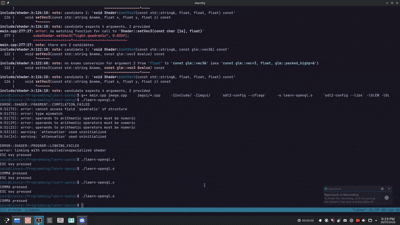

# Learning OpenGL

This is a project where I learn graphics programming using OpenGL by following along with the [learnopengl.com](https://learnopengl.com) guide.

I eventually want to create a "SeaofTheives-like" ocean simulation from scratch.

Most recent cool thing:  

